<div align="center">

# 🕵️ Mafia Doctor

### Trust no one. The truth is hidden.

[](#)
[](#)
[](./LICENSE)
[](#)

*A cinematic, offline, pass-the-phone party game of deception and deduction.*

</div>

---

## 🎭 What is this?

**Mafia Doctor** is a full digital moderator for the classic Mafia / Werewolf party game — no physical cards, no separate narrator required, and no internet connection needed. One phone gets passed around the table; the app privately assigns roles, runs the Night phase, narrates the Morning results, times the Day discussion, and tallies the vote — while keeping every player's secret safe from everyone else at the table.

Built as a single self-contained `index.html` with a handful of cropped atmospheric background images — no frameworks, no build step, no CDN dependencies. Open the file and play.

---

## 📸 Screenshots

<div align="center">
<table>
  <tr>
    <td width="25%">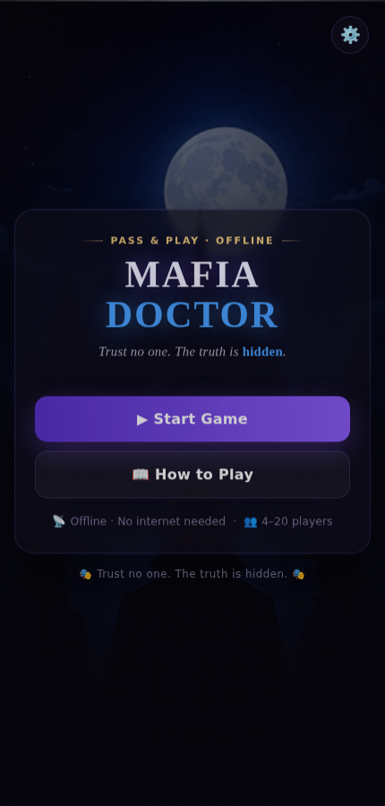<p align="center"><b>Home</b></p></td>
    <td width="25%">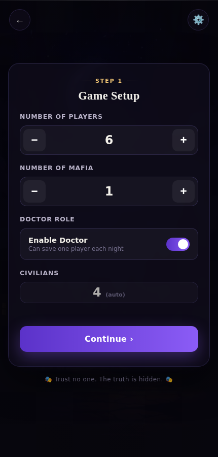<p align="center"><b>Game Setup</b></p></td>
    <td width="25%">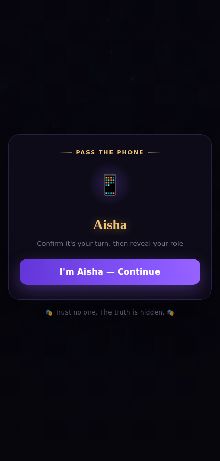<p align="center"><b>Pass the Phone</b></p></td>
    <td width="25%">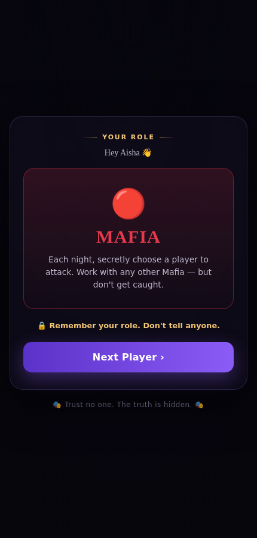<p align="center"><b>Role Reveal</b></p></td>
  </tr>
  <tr>
    <td width="25%">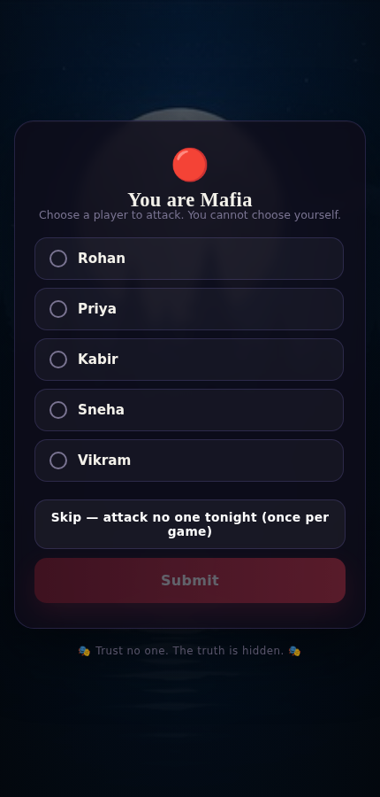<p align="center"><b>Mafia Action</b></p></td>
    <td width="25%">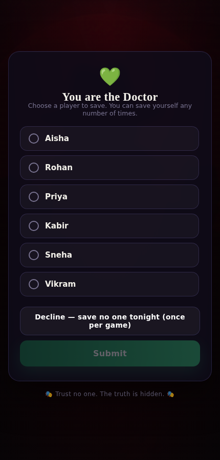<p align="center"><b>Doctor Action</b></p></td>
    <td width="25%">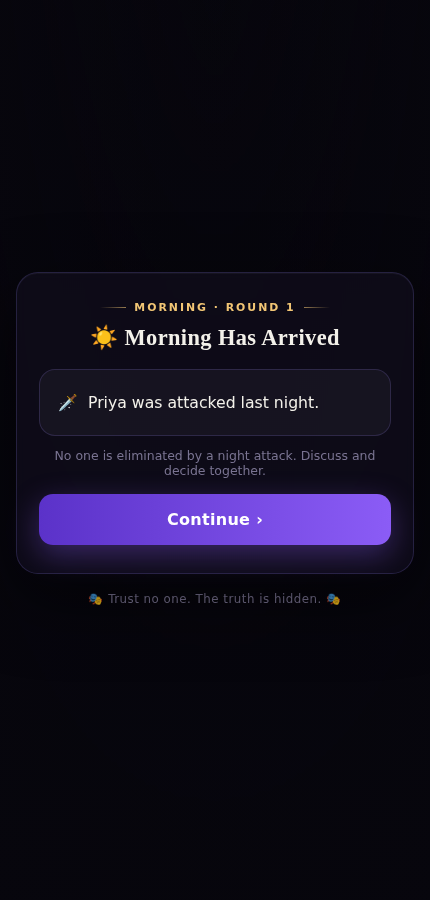<p align="center"><b>Morning Result</b></p></td>
    <td width="25%">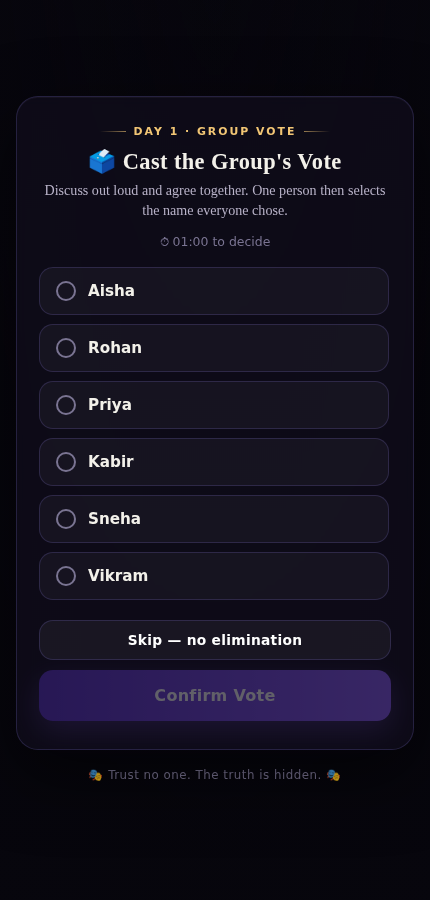<p align="center"><b>Group Vote</b></p></td>
  </tr>
  <tr>
    <td width="25%">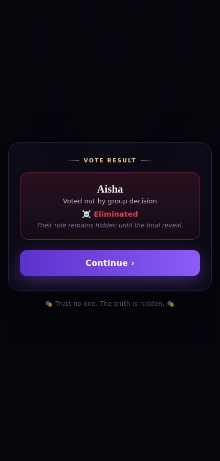<p align="center"><b>Elimination</b></p></td>
    <td width="25%">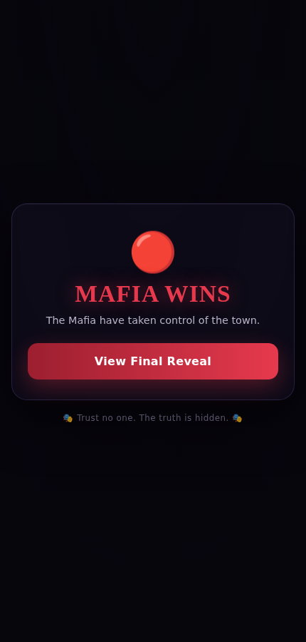<p align="center"><b>Mafia Wins</b></p></td>
    <td width="25%">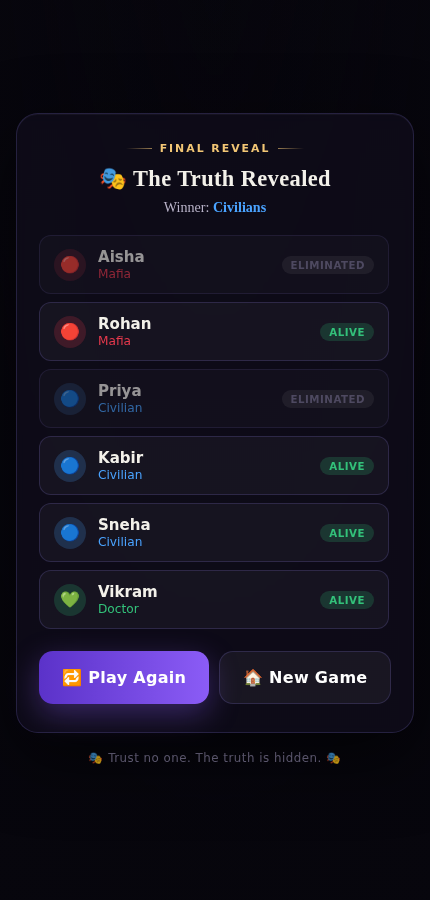<p align="center"><b>Final Reveal</b></p></td>
    <td width="25%">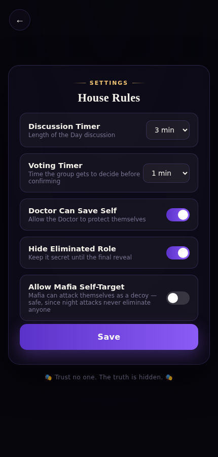<p align="center"><b>House Rules</b></p></td>
  </tr>
</table>
</div>

---

## ✨ Features

| | |
|---|---|
| 🔒 **100% Offline** | No server, no API, no internet needed after the page loads |
| 👥 **4–20 Players** | Configurable Mafia count and an optional Doctor role |
| 🎬 **Cinematic Backgrounds** | Cropped moonlit-village artwork sets the mood per screen |
| 📱 **True Pass-and-Play** | Every private screen (roles, night actions) uses an identical "pass the phone" flow so no one can guess a role from screen count alone |
| 🗳️ **Group Voting** | The table discusses out loud and casts one shared decision — no secret per-player ballots needed |
| 🌙 **Full Night/Day Cycle** | Mafia attack, Doctor save, morning narrator report, discussion timer, then voting |
| 🎭 **Once-Per-Game Twists** | Mafia can skip an attack or target themselves once; Doctor can decline to save once — configurable in House Rules |
| 💚 **Unlimited Self-Save** | The Doctor can protect themselves as many nights as they want |
| 🔀 **Shuffled Turn Order** | Night order is reshuffled every round so there's no fixed pattern to read into |
| ⚙️ **House Rules** | Adjustable discussion/voting timers and toggles for self-save, self-target, and role secrecy |
| 🏆 **Automatic Win Detection** | Civilians win when all Mafia are gone; Mafia win when they equal or outnumber everyone else |

---

## 🎮 How to Play

1. **Setup** — choose player count, Mafia count, and whether a Doctor is in play.
2. **Names** — everyone types their name in, one field each.
3. **Role Reveal** — pass the phone around; each player privately sees their role and nothing else.
4. **Night** — Mafia secretly pick a target, the Doctor secretly picks who to protect, Civilians make a decoy choice with no effect.
5. **Morning** — the narrator reports only what happened (who was attacked, who was saved) — never who did it.
6. **Day** — discuss out loud, then cast one shared group vote to eliminate a suspect.
7. **Repeat** until either all Mafia are eliminated (Civilians win) or the Mafia equal/outnumber the rest of the table (Mafia win).
8. **Final Reveal** — every player's true role and fate is shown at the end.

---

## 🚀 Getting Started

No build tools, no `npm install`, no server required.

```bash
git clone https://github.com/<your-username>/mafia-doctor.git
cd mafia-doctor
```

Then just open `index.html` in any browser — double-click it, or:

```bash
# macOS
open index.html

# Windows
start index.html

# Linux
xdg-open index.html
```

**Important:** keep the `assets/` folder next to `index.html` — the cinematic backgrounds are loaded from there via relative paths, so the two need to stay together.

---

## 🛠️ Tech Stack

- **HTML5** — single-file structure, screens rendered dynamically into one card container
- **CSS3** — custom properties (design tokens), gradient overlays, crossfading background layers, SVG countdown ring
- **Vanilla JavaScript** — zero dependencies, zero frameworks, zero build step — the entire game state machine lives in one `<script>` block

---

## 📁 Project Structure

```
mafia-doctor/
├── index.html          # The entire game — structure, styles & logic
├── README.md            # You are here
├── LICENSE               # MIT License
├── .gitignore
├── assets/               # Cropped cinematic backgrounds used across screens
│   ├── bg-mafia-gang.jpg
│   ├── bg-round-table.jpg
│   ├── bg-town-path.jpg
│   ├── bg-forest-lake.jpg
│   ├── bg-mafia-red.jpg
│   ├── bg-village-sunset.jpg
│   └── bg-village-night.jpg
└── screenshots/          # App screenshots used in this README
```

---

## ⚙️ House Rules (Settings)

Accessible via the gear icon on the Home and Setup screens:

- **Discussion Timer** — 1 / 2 / 3 / 5 minutes
- **Voting Timer** — 30s / 1 / 2 minutes (soft countdown shown during the group vote)
- **Doctor Can Save Self** — on by default, unlimited uses
- **Hide Eliminated Role** — keeps an eliminated player's role secret until the Final Reveal
- **Allow Mafia Self-Target** — off by default; flip it on to let Mafia attack themselves once per game as a decoy (safe, since night attacks never eliminate anyone)

---

## 🗺️ Roadmap Ideas

- [ ] Additional roles (Detective, Vigilante, Jester)
- [ ] Sound cues for night/day transitions
- [ ] Installable as a PWA for a proper home-screen icon
- [ ] Custom background theme packs

Contributions and suggestions welcome — open an issue or a PR.

---

## 📄 License

Released under the [MIT License](./LICENSE) — free to use, modify, and share.

<div align="center">

**🎭 Trust no one. The truth is hidden. 🎭**

</div>
